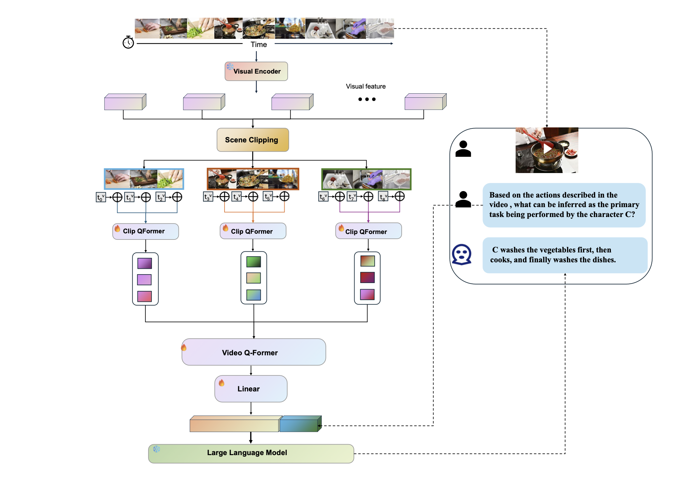

# Scene-Clipping Long Video For Better Understanding

*This project addresses the critical challenge of semantic understanding in long-form video content through an integrated pipeline of scene segmentation and multimodal analysis.*

---

## 1. Abstract
As video content grows in duration and complexity, standard video-language models often struggle with the "lost in the middle" phenomenon and high computational overhead. This project proposes a **Scene-Clipping** approach that decomposes long videos into semantically coherent segments. By leveraging a dual-branch architecture (Visual & Audio) and instruction-tuned Large Language Models, our system achieves superior performance in scene-based question answering and summarization.

## 2. Methodology & Architecture

Our system is built upon a modified **Video-LLaMA** framework, optimized for long video processing via pre-segmentation.

### 2.1 Dual-Branch Encoder
The architecture consists of two core components to capture the multidimensional essence of video data:
- **Vision-Language (VL) Branch**:
  - **Visual Encoder**: ViT-G/14 with a BLIP-2 Q-Former.
  - **Video Q-Former**: A two-layer implementation with a frame embedding layer to aggregate temporal information across clips.
- **Audio-Language (AL) Branch**:
  - **Audio Encoder**: ImageBind-Huge, which provides a unified embedding space for multiple modalities.
  - **Audio Q-Former**: Aligns acoustic features with the LLM's latent space to capture environmental sound and speech context.

### 2.2 Scene-Clipping Pipeline
Instead of feeding the entire raw video into the encoder, we implement a **SceneCut** logic:
1. **Semantic Boundary Detection**: Using visual feature variance and audio cues to identify scene transitions.
2. **Keyframe Extraction**: Selecting representative frames for each scene to reduce redundancy.
3. **Local-Global Aggregation**: Processing individual scenes locally while maintaining a global context vector for the entire video.



## 3. Implementation Details

### 3.1 Training Strategy
The training followed a rigorous two-stage process:
- **Stage 1 (Cross-Modal Alignment)**: Pre-training on WebVid-2M and LLaVA-CC3M to align visual/audio tokens with the language decoder (Vicuna/Llama-2).
- **Stage 2 (Instruction Tuning)**: Fine-tuning on a specialized dataset combining MiniGPT-4, LLaVA-Instruct, and VideoChat data to enhance zero-shot instruction following.

### 3.2 Key Dependencies
- **LLM Backbone**: Llama-2-Chat (7B/13B).
- **Vision**: EVA-CLIP & BLIP-2.
- **Audio**: ImageBind.

## 4. Experimental Results

Our approach was evaluated on the **MLVU (Multi-task Long Video Understanding Benchmark)**, which covers diverse genres and multiple evaluation tasks.

### 4.1 Results on MLVU
The model's zero-shot performance on multiple-choice tasks is summarized below. It significantly outperforms several SOTA methods, including the base Video-LLaMA.

| Methods | **Holistic** (TR) | **Holistic** (AR) | **Single Detail** (NQA) | **Single Detail** (ER) | **Single Detail** (PQA) | **Multi Detail** (AO) | **Multi Detail** (AC) | **M-Avg** |
| :--- | :---: | :---: | :---: | :---: | :---: | :---: | :---: | :---: |
| MovieChat | 29.5 | 25.0 | 24.2 | 24.7 | 25.8 | 28.6 | 22.8 | 25.8 |
| TimeChat | 23.1 | 27.0 | 24.5 | 28.4 | 25.8 | 24.7 | 32.0 | 30.9 |
| Chat-Univi | 33.8 | 34.5 | 30.1 | 34.7 | 36.5 | 22.9 | 27.8 | 35.2 |
| Video-LLaMA | 31.9 | 35.5 | 42.1 | 38.9 | 45.8 | 25.1 | 24.3 | 33.4 |
| **Our Method** | **38.5** | **39.5** | **44.0** | **42.6** | **44.5** | **27.2** | **25.8** | **39.5** |

*Note: TR: Topic Reasoning, AR: Anomaly Recognition, NQA: Needle QA, ER: Ego Reasoning, PQA: Plot QA, AO: Action Order, AC: Action Count. M-Avg: Average performance.*

### 4.2 Ablation Study
We conducted an ablation study to verify the effectiveness of our Scene-Clipping algorithm and the hierarchical feature extraction (Clip Q-former & Video Q-former).

| Method Configuration | M-Avg | $\Delta$ |
| :--- | :---: | :---: |
| Frames avg pooling in clip | 38.8 | -0.7 |
| Clips avg pooling | 35.2 | -4.3 |
| Clips concat | 38.3 | -1.2 |
| Uniform clipping | 31.2 | -8.3 |
| **Current Method (Scene-Clipping)** | **39.5** | - |

**Key Findings:**
- **Scene-Clipping vs. Uniform Clipping**: Dynamic segmentation based on semantic consistency provides an **8.3% improvement**, effectively preserving information across semantic boundaries.
- **Q-former Effectiveness**: Using Clip Q-former instead of simple mean pooling improves the capture of local spatiotemporal relationships.
- **Efficiency**: The architecture significantly reduces memory consumption by aggregating frame-level features into concise clip embeddings.

## 5. Usage & Setup

### Environment
```bash
conda env create -f code/environment.yml
conda activate videollama
```

### Running the Scene-Aware Inference
To process a long video with automatic clipping:
```bash
python code/demo_video.py \
    --cfg-path code/eval_configs/video_llama_eval_withaudio.yaml \
    --gpu-id 0
```

## 6. Conclusion
By modularizing long videos into semantic scenes, we bridge the gap between low-level signal processing and high-level cognitive understanding. Our "Scene-Clipping" framework demonstrates that smart data preprocessing is as vital as model scaling in the quest for true video intelligence.

